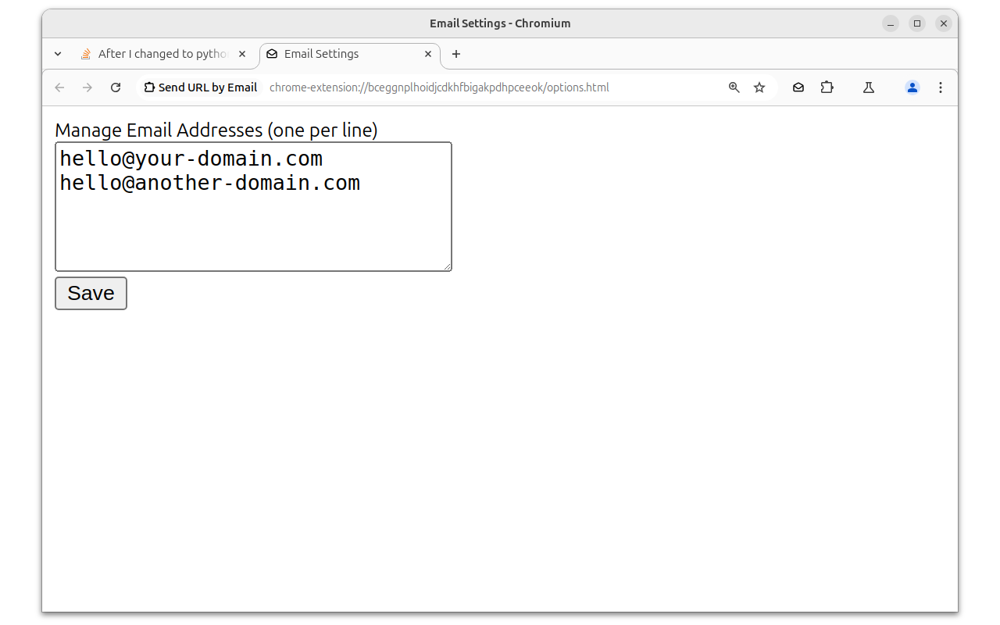
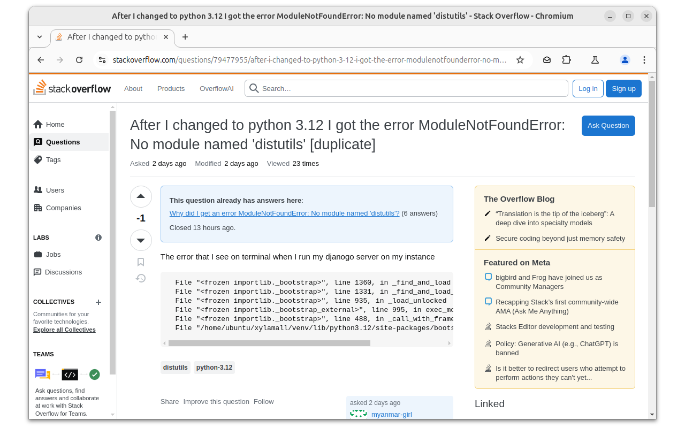
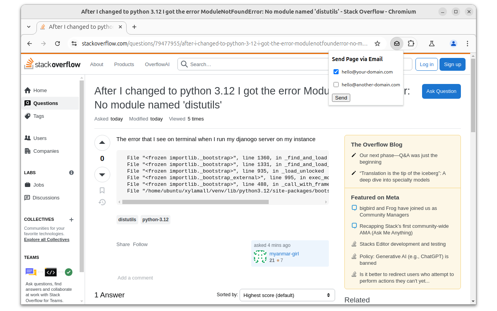

# send-url-by-email-chrome-extension

## 📌 Send URL by Email – The easiest way to share webpages via email!

With this extension, you can quickly and easily send the current webpage title and URL via email. Choose from a list of predefined email addresses or enter a new address directly in your email client.

## 🚀 Features

✔ One-click sharing – Send webpages with just one click using your preferred email client
✔ Customizable recipient list – Save frequently used email addresses for quick selection
✔ Add tags with preselected default tag (optional)
✔ Prefix / suffix tags in subject
✔ Prefix / suffix tags in body
✔ Clean user interface – Simple and intuitive, without unnecessary clutter
✔ No external servers – All data stays local on your device

## 🔧 How it works:

1️⃣ Click on the extension icon
2️⃣ Select the recipients you want to send the link to
3️⃣ Click “Send” – Your default email client will open automatically

## 📌 Perfect for

✅ Colleagues or friends you frequently send links to
✅ Journalists, bloggers, and researchers who save and share webpages
✅ Anyone who wants to share information quickly and efficiently

🌟 Install now and boost your productivity! 🌟

## 📸 Screenshots

### Configure email addresses

### Browse a website

### Send the link to selected email addresses

